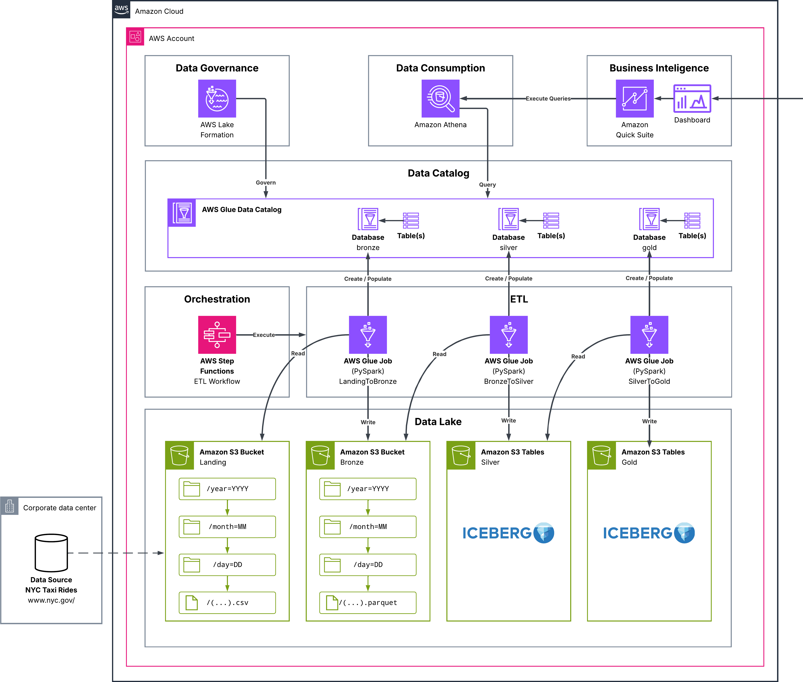

# TaskMaster: Serverless Todo List

Your manager gave you a task to design and implement a complete solution using AWS services.  
You are expected to plan, build, and validate the solution following best practices — step by step.

# Details

| Property | Value |
|---|---|
| **Difficulty** | Advanced |
| **Provider** | AWS |
| **Estimate** | 4–10 hours |
| **Labels** | Serverless, API, Compute, Data, Storage, Monitoring, Auth |

# Tech Stack

- [AWS Lambda](https://docs.aws.amazon.com/lambda/)
- [Amazon API Gateway](https://docs.aws.amazon.com/apigateway/)
- [Amazon DynamoDB](https://docs.aws.amazon.com/dynamodb/)
- [Amazon S3](https://docs.aws.amazon.com/s3/)
- [AWS IAM](https://docs.aws.amazon.com/iam/)
- [Amazon CloudWatch](https://docs.aws.amazon.com/cloudwatch/)
- [AWS Cognito](https://docs.aws.amazon.com/cognito/)
- [Amazon VPC](https://docs.aws.amazon.com/vpc/)

# Prerequisites

Before starting this project, make sure that:
- You have an AWS Account, if not create one with [AWS Account (Free Tier)](https://aws.amazon.com/free) that will cost you nothing
- You are familiar with the AWS Management Console and basic CLI operations
- You understand IAM roles and policies fundamentals
- You have AWS CLI installed and configured locally
- You have basic knowledge of JSON and YAML syntax
- You know how to interpret architecture diagrams
- You are familiar with basics of user authentication

# Project Overview

Your manager assigned you to design and deploy a serverless todo list application that allows logged-in users to create, retrieve, update, and delete tasks. This fully functional application will demonstrate a modern serverless architecture pattern using AWS services. The todo list will allow users to add task descriptions, set due dates, mark items as complete, and filter/sort their tasks.

**What You'll Build:**  
A fully functional serverless todo list application with a RESTful API backed by serverless functions and a NoSQL database, eventually adding a web frontend.

## Key Components

<table>
<tr>
<th>Component</th>
<th>Purpose</th>
<th>Technology</th>
</tr>
<tr>
<td>API Layer</td>
<td>Handles HTTP requests</td>
<td>Amazon API Gateway</td>
</tr>
<tr>
<td>Business Logic</td>
<td>Processes task operations (CRUD)</td>
<td>AWS Lambda with Lambda Powertools</td>
</tr>
<tr>
<td>Data Storage</td>
<td>Stores task information</td>
<td>Amazon DynamoDB (Single Table Design)</td>
</tr>
<tr>
<td>Network</td>
<td>Secure environment for Lambda functions</td>
<td>Amazon VPC with Endpoints</td>
</tr>
<tr>
<td>Frontend</td>
<td>User interface for the todo list</td>
<td>HTML, CSS, JavaScript hosted on S3</td>
</tr>
<tr>
<td>Authentication</td>
<td>Manages user identity and access</td>
<td>AWS Cognito</td>
</tr>
<tr>
<td>Monitoring</td>
<td>Tracks application performance</td>
<td>Amazon CloudWatch</td>
</tr>
</table>

# Architecture

The TaskMaster application follows a serverless architecture pattern where each component is fully managed by AWS. Lambda functions will run within a VPC for enhanced security, communicating with DynamoDB through a VPC endpoint. API Gateway will use Lambda Proxy integration to pass the full request to Lambda functions, allowing more flexibility in request handling.

The DynamoDB table will follow a single-table design pattern, where all application entities and relationships are stored in one table. This approach leverages DynamoDB's key schema and indexing capabilities to enable complex access patterns while minimizing the number of database operations needed.

## API Endpoints

<table>
<tr>
<th>Method</th>
<th>Endpoint</th>
<th>Description</th>
<th>Status Code</th>
<th>Response</th>
</tr>
<tr>
<td><strong>GET</strong></td>
<td><code>/tasks</code></td>
<td>List all tasks for the user</td>
<td>200</td>
<td>Array of task objects</td>
</tr>
<tr>
<td><strong>GET</strong></td>
<td><code>/tasks/{id}</code></td>
<td>Get a specific task</td>
<td>200, 404</td>
<td>Single task object</td>
</tr>
<tr>
<td><strong>POST</strong></td>
<td><code>/tasks</code></td>
<td>Create a new task</td>
<td>201</td>
<td>Created task object with ID</td>
</tr>
<tr>
<td><strong>PUT</strong></td>
<td><code>/tasks/{id}</code></td>
<td>Update an existing task</td>
<td>200, 404</td>
<td>Updated task object</td>
</tr>
<tr>
<td><strong>DELETE</strong></td>
<td><code>/tasks/{id}</code></td>
<td>Delete a task</td>
<td>204, 404</td>
<td>No content</td>
</tr>
<tr>
<td><strong>GET</strong></td>
<td><code>/tasks/status/{status}</code></td>
<td>Filter tasks by status</td>
<td>200</td>
<td>Array of filtered task objects</td>
</tr>
<tr>
<td><strong>GET</strong></td>
<td><code>/tasks/due/{date}</code></td>
<td>Get tasks due by date</td>
<td>200</td>
<td>Array of task objects</td>
</tr>
</table>

> **Diagram to Draw:**  
> Include components showing the flow from API Gateway, to Lambda functions in VPC that interact with DynamoDB through VPC endpoint. Show Cognito for authentication and CloudWatch for monitoring.

# Learning Objectives

After completing this project, you will be able to:
- Design and implement a serverless application using multiple AWS services
- Create and configure RESTful APIs using Amazon API Gateway with Lambda Proxy integration
- Implement AWS Lambda Powertools for logging, tracing, and metrics
- Design a DynamoDB single-table architecture for efficient data access
- Configure Lambda functions to run within a VPC with appropriate security
- Set up VPC endpoints for secure service access
- Implement user authentication with Amazon Cognito
- Configure appropriate IAM roles and policies
- Monitor application performance using CloudWatch
- Deploy a static website to Amazon S3

# Tasks

Each phase focuses on a separate part of the project.  
You will implement components gradually, testing after each phase.

## Phase 1: Foundation Setup

<table>
<tr>
<th>Task ID</th>
<th>Description</th>
<th>Status</th>
</tr>
<tr>
<td><strong>TASK-01</strong></td>
<td><strong>DynamoDB Table Setup</strong> Create a DynamoDB table following single-table design principles. The table should use a composite primary key with PK (partition key) for user/task identification and SK (sort key) for item type or metadata. Create GSIs (Global Secondary Indexes) for querying tasks by status and due date. In a single-table design, all application data is stored in one table rather than separate tables for different entity types, which reduces API calls, maintains transactional integrity, simplifies scaling, and improves cost efficiency.  

> <strong>Hint:</strong> Before creating the table, list all access patterns (single table design requirement). 

> <strong>Note:</strong> Initially treat this as a system without users - users will be added in the authentication phase.</td>
<td>⬜</td>
</tr>
<tr>
<td><strong>TASK-02</strong></td>
<td><strong>VPC Setup</strong> Create a VPC with private subnets for Lambda functions. The VPC should have at least two private subnets across different availability zones for high availability. No public subnets are needed as Lambda functions will communicate with AWS services via VPC endpoints.</td>
<td>⬜</td>
</tr>
<tr>
<td><strong>TASK-03</strong></td>
<td><strong>VPC Endpoint Configuration</strong> Set up a VPC endpoint for DynamoDB. This endpoint will allow Lambda functions in your private VPC to securely connect to DynamoDB without going through the public internet, enhancing security.</td>
<td>⬜</td>
</tr>
</table>

## Phase 2: API Gateway Setup

<table>
<tr>
<th>Task ID</th>
<th>Description</th>
<th>Status</th>
</tr>
<tr>
<td><strong>TASK-04</strong></td>
<td><strong>API Gateway Structure</strong> Create an API Gateway REST API with the complete resource structure. Define all resources: <code>/tasks</code>, <code>/tasks/{id}</code>, <code>/tasks/status/{status}</code>, and <code>/tasks/due/{date}</code>. Create methods (<strong>GET</strong>, <strong>POST</strong>, <strong>PUT</strong>, <strong>DELETE</strong>) for each resource according to the API endpoints table. Do NOT set up integrations yet - just create the API structure. This gives you the endpoint structure that your Lambda functions need to match.</td>
<td>⬜</td>
</tr>
<tr>
<td><strong>TASK-05</strong></td>
<td><strong>Mock Lambda Function</strong> Create a mock Lambda function that returns a sample response. This function will help you understand the required response structure for Lambda Proxy integration. The function should return a response with statusCode, headers (including CORS headers), and a body (JSON stringified). Test this mock function directly in the Lambda console to verify the response format. Example response structure: <code>{"statusCode": 200, "headers": {"Content-Type": "application/json", "Access-Control-Allow-Origin": "*"}, "body": "{\"message\": \"Hello from Lambda\"}"}</code></td>
<td>⬜</td>
</tr>
<tr>
<td><strong>TASK-06</strong></td>
<td><strong>Lambda Proxy Integration</strong> Set up Lambda Proxy integration for one test endpoint (<strong>GET</strong> <code>/tasks</code>). Connect your mock Lambda function to the <strong>GET</strong> <code>/tasks</code> method using Lambda Proxy integration. Deploy the API to a test stage. Test the endpoint using the AWS console test feature or curl to verify the integration works and you understand the request/response format.</td>
<td>⬜</td>
</tr>
</table>

## Phase 3: Build Lambda Functions Incrementally

<table>
<tr>
<th>Task ID</th>
<th>Description</th>
<th>Status</th>
</tr>
<tr>
<td><strong>TASK-07</strong></td>
<td><strong>IAM Role Setup</strong> Set up the Lambda execution role and basic IAM policies. Create an IAM role for Lambda execution that includes permissions to create logs in CloudWatch, create network interfaces in VPC (EC2 permissions), and basic DynamoDB access. This role will be used by all your Lambda functions. Document the permissions granted.</td>
<td>⬜</td>
</tr>
<tr>
<td><strong>TASK-08</strong></td>
<td><strong>List Tasks Function</strong> Implement the "List Tasks" Lambda function (**GET** `/tasks`). Create a new Lambda function that queries DynamoDB for all tasks belonging to a user. Use AWS Lambda Powertools for structured logging. Configure the function to run in your VPC. The function should parse the user ID from the request context (we'll add real authentication later, for now use a test user ID). Return tasks in the proper Lambda Proxy format. Deploy and test this function through API Gateway.</td>
<td>⬜</td>
</tr>
<tr>
<td><strong>TASK-09</strong></td>
<td><strong>Create Task Function</strong> Implement the "Create Task" Lambda function (**POST** `/tasks`). Create a Lambda function that accepts task data in the request body, validates the input, generates a unique task ID, and stores it in DynamoDB. Include proper error handling for invalid input. Use Lambda Powertools for logging and metrics. Configure to run in VPC. Test through API Gateway by creating a task and verifying it appears in DynamoDB.</td>
<td>⬜</td>
</tr>
<tr>
<td><strong>TASK-10</strong></td>
<td><strong>Get Task by ID Function</strong> Implement the "Get Task by ID" Lambda function (**GET** `/tasks/{id}`). Create a function that retrieves a specific task by its ID from DynamoDB. Handle the case where the task doesn't exist (return 404). Parse the task ID from the path parameters. Test through API Gateway with both valid and invalid task IDs.</td>
<td>⬜</td>
</tr>
<tr>
<td><strong>TASK-11</strong></td>
<td><strong>Update Task Function</strong> Implement the "Update Task" Lambda function (**PUT** `/tasks/{id}`). Create a function that updates an existing task with new data. Validate that the task exists before updating. Handle partial updates (only update fields that are provided). Return the updated task. Test through API Gateway by updating a task's status or description.</td>
<td>⬜</td>
</tr>
<tr>
<td><strong>TASK-12</strong></td>
<td><strong>Delete Task Function</strong> Implement the "Delete Task" Lambda function (**DELETE** `/tasks/{id}`). Create a function that deletes a task from DynamoDB. Return 204 (No Content) on success or 404 if the task doesn't exist. Test through API Gateway by deleting a task and verifying it's removed from DynamoDB.</td>
<td>⬜</td>
</tr>
<tr>
<td><strong>TASK-13</strong></td>
<td><strong>Filtering Functions</strong> Implement filtering functions (**GET** `/tasks/status/{status}` and **GET** `/tasks/due/{date}`). Create Lambda functions that use DynamoDB GSIs to filter tasks by status or due date. These functions should demonstrate how to query using secondary indexes. Test both endpoints through API Gateway with various filter values.</td>
<td>⬜</td>
</tr>
</table>

## Phase 4: Enhanced Monitoring and Error Handling

<table>
<tr>
<th>Task ID</th>
<th>Description</th>
<th>Status</th>
</tr>
<tr>
<td><strong>TASK-14</strong></td>
<td><strong>Enhanced Logging</strong> Implement comprehensive logging with Lambda Powertools. Update all Lambda functions to use structured logging with correlation IDs. Add custom metrics for operation counts and latencies. Ensure all error cases are properly logged with context.</td>
<td>⬜</td>
</tr>
<tr>
<td><strong>TASK-15</strong></td>
<td><strong>X-Ray Tracing</strong> Set up X-Ray tracing for request flow visualization. Enable X-Ray tracing on API Gateway and all Lambda functions. Use Lambda Powertools' tracing decorator to instrument your functions. Create a test scenario and view the service map in X-Ray console to understand the request flow.</td>
<td>⬜</td>
</tr>
<tr>
<td><strong>TASK-16</strong></td>
<td><strong>CloudWatch Dashboard</strong> Create a CloudWatch dashboard for monitoring. Build a dashboard with widgets showing Lambda invocations, errors, duration, API Gateway request counts, latency, DynamoDB consumed capacity, and custom metrics. This dashboard should give you complete visibility into your application's health.</td>
<td>⬜</td>
</tr>
<tr>
<td><strong>TASK-17</strong></td>
<td><strong>Input Validation</strong> Implement input validation and error handling. Add request validators in API Gateway for request bodies and parameters. Enhance Lambda functions with comprehensive error handling, returning appropriate HTTP status codes (400 for bad requests, 404 for not found, 500 for server errors). Test error scenarios through API Gateway.</td>
<td>⬜</td>
</tr>
</table>

## Phase 5: Add Authentication

<table>
<tr>
<th>Task ID</th>
<th>Description</th>
<th>Status</th>
</tr>
<tr>
<td><strong>TASK-18</strong></td>
<td><strong>Cognito User Pool</strong> Set up Amazon Cognito User Pool for authentication. Configure a User Pool with appropriate password policies, MFA settings (optional), and required attributes (email, name). Create an app client for your API. Set up email verification for user registration. Document the User Pool ID and App Client ID.</td>
<td>⬜</td>
</tr>
<tr>
<td><strong>TASK-19</strong></td>
<td><strong>API Gateway Authorization</strong> Configure API Gateway to use Cognito authorizers. Create a Cognito User Pool authorizer for your API. Apply the authorizer to all API methods. Update CORS configuration to allow the Authorization header.</td>
<td>⬜</td>
</tr>
<tr>
<td><strong>TASK-20</strong></td>
<td><strong>JWT Token Integration</strong> Update Lambda functions to extract user information from JWT tokens. Modify all Lambda functions to read the user ID from the Cognito JWT token passed in the request context. This ensures tasks are associated with the correct user. Test by creating a test user in Cognito and making authenticated API calls.</td>
<td>⬜</td>
</tr>
<tr>
<td><strong>TASK-21</strong></td>
<td><strong>Authentication Testing</strong> Test the complete authenticated flow. Register a test user through Cognito. Obtain JWT tokens using the authentication flow. Test all API endpoints with the Authorization header containing the JWT token. Verify that unauthenticated requests are rejected and authenticated requests properly associate tasks with the user.</td>
<td>⬜</td>
</tr>
</table>

## Phase 6: Frontend Implementation

<table>
<tr>
<th>Task ID</th>
<th>Description</th>
<th>Status</th>
</tr>
<tr>
<td><strong>TASK-22</strong></td>
<td><strong>S3 Static Hosting</strong> Create an S3 bucket for static website hosting. Configure the bucket for static website hosting with appropriate bucket policies. Set up CORS configuration to allow requests from your API. Configure index and error documents.</td>
<td>⬜</td>
</tr>
<tr>
<td><strong>TASK-23</strong></td>
<td><strong>Frontend Structure</strong> Develop the frontend HTML/CSS structure. Create a responsive UI with components for login/signup, task listing, task creation form, and task management (edit/delete). Style the interface to be user-friendly and professional. No JavaScript functionality yet - just the structure and styling.</td>
<td>⬜</td>
</tr>
<tr>
<td><strong>TASK-24</strong></td>
<td><strong>Frontend Authentication</strong> Implement Cognito authentication in the frontend. Integrate the Cognito JavaScript SDK or Amazon Amplify for authentication. Create signup, signin, and signout flows. Implement token storage and management. Test the authentication flow independently before connecting to the API.</td>
<td>⬜</td>
</tr>
<tr>
<td><strong>TASK-25</strong></td>
<td><strong>API Integration</strong> Connect frontend to API endpoints. Implement JavaScript functions to call all API endpoints with proper authentication headers. Add functionality to display tasks, create new tasks, update task status, and delete tasks. Implement client-side filtering and sorting. Test the complete flow from login to task management.</td>
<td>⬜</td>
</tr>
<tr>
<td><strong>TASK-26</strong></td>
<td><strong>Complete Application Testing</strong> Deploy and test the complete application. Upload the frontend files to S3. Verify the website is accessible. Test the complete user journey from registration to task management. Verify all features work correctly end-to-end.</td>
<td>⬜</td>
</tr>
</table>

## Phase 7: Performance and Optimization

<table>
<tr>
<th>Task ID</th>
<th>Description</th>
<th>Status</th>
</tr>
<tr>
<td><strong>TASK-27</strong></td>
<td><strong>CloudWatch Alarms</strong> Set up CloudWatch alarms for critical metrics. Create alarms for API errors (4xx/5xx rates), Lambda errors and throttling, DynamoDB throttling, and high latency. Configure SNS notifications for alarm triggers.</td>
<td>⬜</td>
</tr>
<tr>
<td><strong>TASK-28</strong></td>
<td><strong>Load Testing</strong> Perform load testing. Use a tool like Artillery to simulate multiple concurrent users performing various operations. Monitor CloudWatch metrics during the test. Identify any performance bottlenecks or errors under load.</td>
<td>⬜</td>
</tr>
<tr>
<td><strong>TASK-29</strong></td>
<td><strong>Performance Optimization</strong> Optimize based on performance data. Analyze CloudWatch metrics and X-Ray traces to identify optimization opportunities. Adjust Lambda memory allocation, timeout settings, and DynamoDB provisioned capacity based on actual usage patterns. Re-test after optimizations.</td>
<td>⬜</td>
</tr>
</table>

## Phase 8: Cleanup and Documentation

<table>
<tr>
<th>Task ID</th>
<th>Description</th>
<th>Status</th>
</tr>
<tr>
<td><strong>TASK-30</strong></td>
<td><strong>Architecture Documentation</strong> Document the complete architecture and setup. Create a comprehensive README.md with architecture diagram, component descriptions, API documentation, setup instructions, and configuration details. Include example requests and responses for each API endpoint.</td>
<td>⬜</td>
</tr>
<tr>
<td><strong>TASK-31</strong></td>
<td><strong>Application Demonstration</strong> Create a demonstration of the application. Prepare a demonstration script showcasing all key features. Record a short video or prepare a live demo showing user registration, authentication, and all task management features.</td>
<td>⬜</td>
</tr>
<tr>
<td><strong>TASK-32</strong></td>
<td><strong>Resource Cleanup</strong> Clean up all AWS resources. Delete resources in the correct order to avoid dependency conflicts: API Gateway, Lambda functions, VPC endpoints, VPC (including subnets and security groups), DynamoDB table, S3 bucket contents and bucket, Cognito User Pool, CloudWatch logs and dashboards, IAM roles and policies. Verify all resources are removed to prevent unexpected charges.</td>
<td>⬜</td>
</tr>
</table>

# Success Criteria

To successfully complete this project:
- All API endpoints are properly secured and functioning
- Lambda functions are deployed in a VPC with appropriate security
- Each Lambda function was tested individually before moving to the next
- Data is correctly stored and retrieved from DynamoDB using single-table design
- Authentication is working correctly with Cognito
- Lambda Powertools are implemented for logging, metrics, and tracing
- The application has appropriate error handling and input validation
- A functional frontend allows users to manage tasks through a web interface
- The architecture follows serverless best practices
- All AWS resources are properly cleaned up after completion

# Bonus Challenges

Want to take it further? Try one or more of these:
- Implement task categories or tags using DynamoDB's secondary indexes
- Add due dates and reminder notifications using EventBridge and SNS
- Create a CI/CD pipeline using AWS CodePipeline for automated deployment
- Implement Infrastructure as Code using AWS CDK or SAM
- Add a GraphQL API using AWS AppSync as an alternative interface
- Implement task sharing capabilities between users
- Add real-time updates using WebSockets API and Lambda
- Implement CloudFront distribution for the frontend for better performance
- Perform advanced load testing using Apache JMeter for comprehensive performance analysis

# Resources

Useful AWS documentation and learning materials:
- [AWS Lambda Developer Guide](https://docs.aws.amazon.com/lambda/latest/dg/welcome.html)
- [AWS Lambda Powertools Python](https://awslabs.github.io/aws-lambda-powertools-python/latest/)
- [Lambda Proxy Integration Response Format](https://docs.aws.amazon.com/apigateway/latest/developerguide/set-up-lambda-proxy-integrations.html#api-gateway-simple-proxy-for-lambda-output-format)
- [Amazon API Gateway Developer Guide](https://docs.aws.amazon.com/apigateway/latest/developerguide/welcome.html)
- [DynamoDB Single Table Design](https://www.alexdebrie.com/posts/dynamodb-single-table/)
- [Amazon DynamoDB Developer Guide](https://docs.aws.amazon.com/amazondynamodb/latest/developerguide/Introduction.html)
- [VPC Endpoints for AWS Services](https://docs.aws.amazon.com/vpc/latest/privatelink/vpc-endpoints.html)
- [AWS Cognito Developer Guide](https://docs.aws.amazon.com/cognito/latest/developerguide/what-is-amazon-cognito.html)
- [Amazon S3 Static Website Hosting](https://docs.aws.amazon.com/AmazonS3/latest/userguide/WebsiteHosting.html)
- [AWS X-Ray Developer Guide](https://docs.aws.amazon.com/xray/latest/devguide/aws-xray.html)