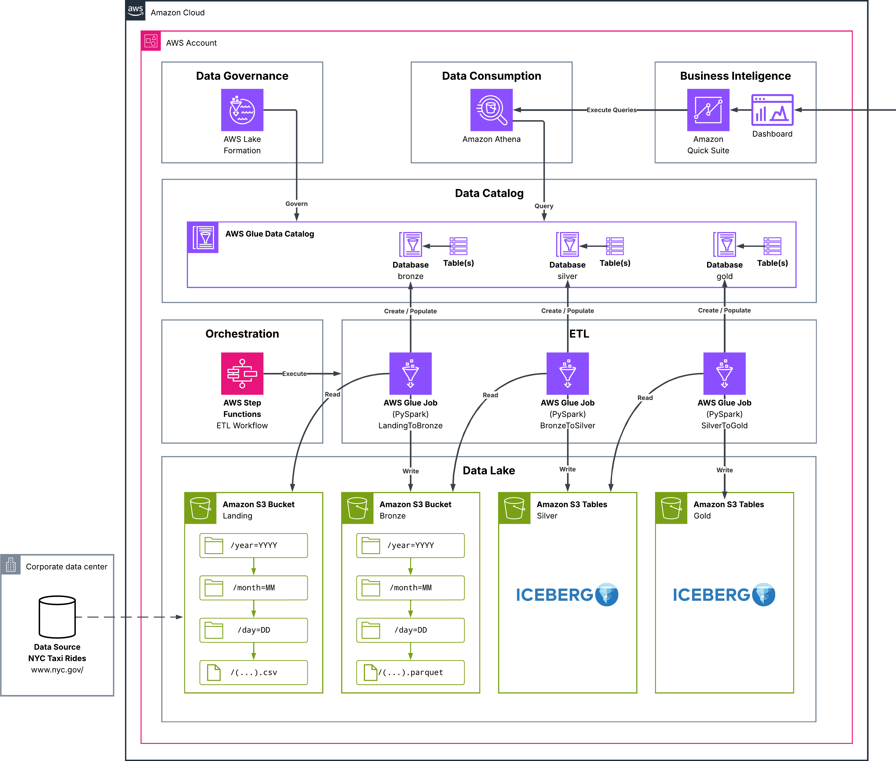

# To-Do List Application

Your manager has assigned you to design and implement a complete solution using AWS services. You are expected to plan, build, and validate the solution following best practices — step by step.

## Project Details

| **Property** | **Value** |
|:---|:---|
| **Difficulty** | `Advanced` |
| **Provider** | `AWS` |
| **Estimate** | `4–10 hours` |
| **Tech Stack** | `AWS Lambda` `Amazon API Gateway` `Amazon DynamoDB` `Amazon S3` `AWS IAM` `Amazon CloudWatch` `AWS Cognito` `Amazon VPC` |
| **Labels** | `Serverless` `API` `Compute` `Data` `Storage` `Monitoring` `Auth` |
| **Prerequisites** | <ul><li>**AWS Account** — Create one with <a href="https://aws.amazon.com/free" target="_blank">AWS Free Tier</a> (no cost)</li><li>**AWS Management Console** familiarity and basic CLI operations</li><li>**IAM roles and policies** fundamentals understanding</li><li>**AWS CLI** installed and configured locally</li><li>**JSON and YAML** syntax knowledge</li><li>**Architecture diagrams** interpretation skills</li><li>**User authentication** basics</li></ul> |
| **Learning Objectives** | <ul><li>Design and implement serverless applications using multiple AWS services</li><li>Create and configure RESTful APIs using Amazon API Gateway with Lambda Proxy integration</li><li>Implement AWS Lambda Powertools for logging, tracing, and metrics</li><li>Design a DynamoDB single-table architecture for efficient data access</li><li>Configure Lambda functions to run within a VPC with appropriate security</li><li>Set up VPC endpoints for secure service access</li><li>Implement user authentication with Amazon Cognito</li><li>Configure appropriate IAM roles and policies</li><li>Monitor application performance using CloudWatch</li><li>Deploy a static website to Amazon S3</li></ul> |
| **Resources** | <ul><li><a href="https://docs.aws.amazon.com/lambda/latest/dg/welcome.html" target="_blank">AWS Lambda Developer Guide</a></li><li><a href="https://awslabs.github.io/aws-lambda-powertools-python/latest/" target="_blank">AWS Lambda Powertools Python</a></li><li><a href="https://docs.aws.amazon.com/apigateway/latest/developerguide/set-up-lambda-proxy-integrations.html#api-gateway-simple-proxy-for-lambda-output-format" target="_blank">Lambda Proxy Integration Response Format</a></li><li><a href="https://docs.aws.amazon.com/apigateway/latest/developerguide/welcome.html" target="_blank">Amazon API Gateway Developer Guide</a></li><li><a href="https://www.alexdebrie.com/posts/dynamodb-single-table/" target="_blank">DynamoDB Single Table Design</a></li><li><a href="https://docs.aws.amazon.com/amazondynamodb/latest/developerguide/Introduction.html" target="_blank">Amazon DynamoDB Developer Guide</a></li><li><a href="https://docs.aws.amazon.com/vpc/latest/privatelink/vpc-endpoints.html" target="_blank">VPC Endpoints for AWS Services</a></li><li><a href="https://docs.aws.amazon.com/cognito/latest/developerguide/what-is-amazon-cognito.html" target="_blank">AWS Cognito Developer Guide</a></li><li><a href="https://docs.aws.amazon.com/AmazonS3/latest/userguide/WebsiteHosting.html" target="_blank">Amazon S3 Static Website Hosting</a></li><li><a href="https://docs.aws.amazon.com/xray/latest/devguide/aws-xray.html" target="_blank">AWS X-Ray Developer Guide</a></li></ul> |

## Project Overview

Your manager has assigned you to design and deploy a serverless todo list application that enables authenticated users to create, retrieve, update, and delete tasks. This comprehensive application demonstrates modern serverless architecture patterns using AWS services, featuring task management with descriptions, due dates, completion status, and intelligent sorting/filtering capabilities.

### What You'll Build

A **fully functional serverless todo list application** featuring:
- **RESTful API** backed by serverless functions
- **NoSQL database** with single-table design
- **Web frontend** for intuitive task management
- **Enterprise authentication** and authorization
- **Comprehensive monitoring** and logging

### Key Components

| **Component** | **Purpose** | **Technology** |
|:---|:---|:---|
| **API Layer** | Handles HTTP requests and routing | `Amazon API Gateway` |
| **Business Logic** | Processes task operations (CRUD) | `AWS Lambda` with `Lambda Powertools` |
| **Data Storage** | Stores task information | `Amazon DynamoDB` (Single Table Design) |
| **Network** | Secure environment for Lambda functions | `Amazon VPC` with Endpoints |
| **Frontend** | User interface for the todo list | `HTML`, `CSS`, `JavaScript` hosted on `S3` |
| **Authentication** | Manages user identity and access | `AWS Cognito` |
| **Monitoring** | Tracks application performance | `Amazon CloudWatch` |

## Architecture

The TaskMaster application follows a serverless architecture pattern where each component is fully managed by AWS. Lambda functions will run within a VPC for enhanced security, communicating with DynamoDB through a VPC endpoint. API Gateway will use Lambda Proxy integration to pass the full request to Lambda functions, allowing more flexibility in request handling.

The DynamoDB table will follow a single-table design pattern, where all application entities and relationships are stored in one table. This approach leverages DynamoDB's key schema and indexing capabilities to enable complex access patterns while minimizing the number of database operations needed.

### API Endpoints

| **Method** | **Endpoint** | **Description** | **Status Code** | **Response** |
|:---|:---|:---|:---|:---|
| `GET` | `/tasks` | List all tasks for the user | `200` | Array of task objects |
| `GET` | `/tasks/{id}` | Get a specific task | `200`, `404` | Single task object |
| `POST` | `/tasks` | Create a new task | `201` | Created task object with ID |
| `PUT` | `/tasks/{id}` | Update an existing task | `200`, `404` | Updated task object |
| `DELETE` | `/tasks/{id}` | Delete a task | `204`, `404` | No content |
| `GET` | `/tasks/status/{status}` | Filter tasks by status | `200` | Array of filtered task objects |
| `GET` | `/tasks/due/{date}` | Get tasks due by date | `200` | Array of task objects |

> **Diagram to Draw:**  
> Include components showing the flow from API Gateway, to Lambda functions in VPC that interact with DynamoDB through VPC endpoint. Show Cognito for authentication and CloudWatch for monitoring.

## Success Criteria

To successfully complete this project:

- All API endpoints are properly secured and functioning
- Lambda functions are deployed in a VPC with appropriate security
- Each Lambda function was tested individually before moving to the next
- Data is correctly stored and retrieved from DynamoDB using single-table design
- Authentication is working correctly with Cognito
- Lambda Powertools are implemented for logging, metrics, and tracing
- The application has appropriate error handling and input validation
- A functional frontend allows users to manage tasks through a web interface
- The architecture follows serverless best practices
- All AWS resources are properly cleaned up after completion

---

## Bonus Challenges

Want to take it further? Try one or more of these advanced features:

- Implement task categories or tags using DynamoDB's secondary indexes
- Add due dates and reminder notifications using EventBridge and SNS
- Create a CI/CD pipeline using AWS CodePipeline for automated deployment
- Implement Infrastructure as Code using AWS CDK or SAM
- Add a GraphQL API using AWS AppSync as an alternative interface
- Implement task sharing capabilities between users
- Add real-time updates using WebSockets API and Lambda
- Implement CloudFront distribution for the frontend for better performance
- Perform advanced load testing using Apache JMeter for comprehensive performance analysis
